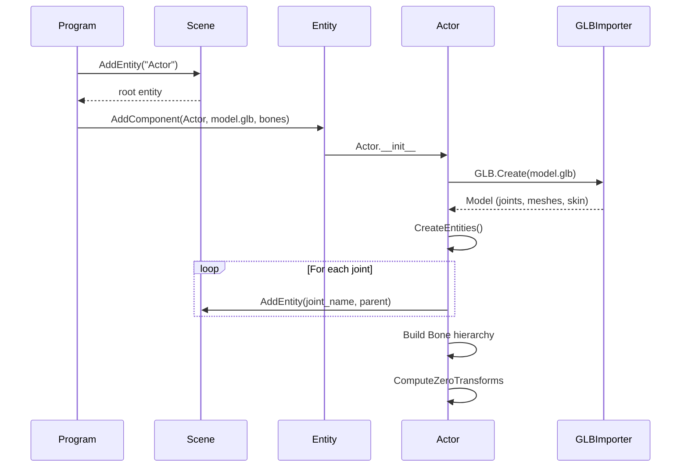

# Actor API

The `Actor` component represents a skeletal character. It loads a 3D model, creates scene entities for each bone, and provides a rich API for manipulating transforms, velocities, bone lengths, and alignments.

**File:** `ai4animation/Components/Actor.py`

---

## Overview

`Actor` extends `Component` and is the primary way to work with animated characters. When attached to an entity, it loads a 3D model (GLB or FBX), creates scene entities for each bone, builds a `Bone` hierarchy, and computes rest-pose transforms.

```python
from ai4animation import Actor, AI4Animation, Vector3

entity = AI4Animation.Scene.AddEntity("Character")
actor = entity.AddComponent(Actor, "path/to/Model.glb", bone_names, True)
actor.Entity.SetPosition(Vector3.Create(0, 0, 0))
```

**Parameters:**

| Parameter | Type | Description |
|-----------|------|-------------|
| `model_path` | `str` | Path to GLB or FBX file |
| `bone_names` | `List[str]` | Names of bones to include |
| `create_skinned_mesh` | `bool` | Whether to create GPU skinned mesh (standalone only) |

---

## Transform Operations

### Batch Operations

| Method | Signature | Description |
|--------|-----------|-------------|
| `SetTransforms` | `(transforms)` | Set all bone transforms `[NumBones, 4, 4]` |
| `GetTransforms` | `() → ndarray` | Get all bone transforms `[NumBones, 4, 4]` |
| `SetPositions` | `(positions)` | Set all bone positions `[NumBones, 3]` |
| `GetPositions` | `() → ndarray` | Get all bone positions `[NumBones, 3]` |
| `SetRotations` | `(rotations)` | Set all bone rotations `[NumBones, 3, 3]` |
| `GetRotations` | `() → ndarray` | Get all bone rotations `[NumBones, 3, 3]` |
| `SetVelocities` | `(velocities)` | Set all bone velocities `[NumBones, 3]` |
| `GetVelocities` | `() → ndarray` | Get all bone velocities `[NumBones, 3]` |

### Scene Synchronization

| Method | Description |
|--------|-------------|
| `SyncToScene()` | Pushes actor bone transforms to scene entities |
| `SyncToScene(bones)` | Pushes specific bones' transforms to scene |
| `SyncFromScene()` | Pulls scene entity transforms into actor |

```python
actor.SetTransforms(new_transforms)
actor.SyncToScene()

actor.SyncFromScene()
```

---

## Bone Management

### Accessing Bones

```python
bone = actor.GetBone("LeftHand")
bone = actor.Bones[5]
chain = actor.GetChain("Shoulder", "Wrist")
```

### Bone Corrections

| Method | Description |
|--------|-------------|
| `RestoreBoneLengths()` | Enforces default bone lengths from rest pose |
| `RestoreBoneAlignments()` | Re-aligns bone rotations from positions |

These are useful after neural network inference to fix drift in bone lengths.

---

## Actor.Bone

The `Bone` inner class represents a single bone in the skeleton.

### Properties

| Property | Type | Description |
|----------|------|-------------|
| `Actor` | `Actor` | Owning actor |
| `Index` | `int` | Index into actor's transforms tensor |
| `Entity` | `Entity` | Corresponding scene entity |
| `Parent` | `Bone` | Parent bone (`None` for root) |
| `Children` | `List[Bone]` | Child bones |
| `Successors` | `List[int]` | All descendant bone indices |
| `ZeroTransform` | `ndarray [4, 4]` | Rest-pose transform relative to parent |

### Methods

| Method | Description |
|--------|-------------|
| `GetPosition()` | Get bone world position |
| `GetRotation()` | Get bone world rotation |
| `GetTransform()` | Get bone world transform (4×4) |
| `SetPosition(pos)` | Set bone world position |
| `SetRotation(rot)` | Set bone world rotation |
| `SetTransform(t)` | Set bone world transform |

---

## Loading Flow



---

## Example

```python
import os
from ai4animation import Actor, AI4Animation, Rotation, Time, Vector3


class Program:
    def Start(self):
        entity = AI4Animation.Scene.AddEntity("Actor")
        self.Actor = entity.AddComponent(
            Actor, "assets/Model.glb", bone_names, True
        )

    def Update(self):
        self.Actor.Entity.SetRotation(
            Rotation.Euler(0, 120 * Time.TotalTime, 0)
        )
        self.Actor.SyncFromScene()

        positions = self.Actor.GetPositions()
        rotations = self.Actor.GetRotations()
```
