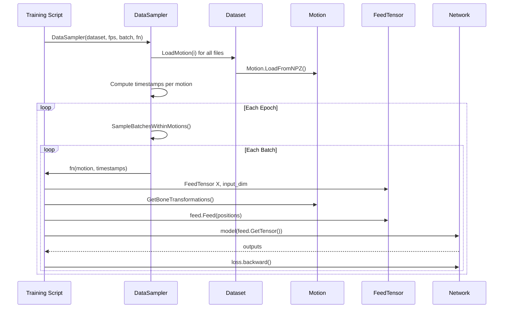

# AI System

Neural network layers, training utilities, and inference tools for learning motion models.

**Files:** `ai4animation/AI/Modules.py`, `DataSampler.py`, `FeedTensor.py`, `ReadTensor.py`, `Stats.py`, `ONNXNetwork.py`

---

## Neural Network Layers

**File:** `ai4animation/AI/Modules.py`

### LinearLayer

Standard dense layer with optional dropout and activation.

```python
from ai4animation.AI.Modules import LinearLayer

layer = LinearLayer(input_dim=256, output_dim=128, dropout=0.1, activation="ELU")
```

### FiLMLayer

Feature-wise Linear Modulation — applies learned scale and shift to features.

```python
layer = FiLMLayer(input_dim=256, output_dim=128)
# output = scale * input + shift
```

### LinearExpertsLayer

Mixture of experts linear layer — multiple expert weight matrices blended by gating.

```python
layer = LinearExpertsLayer(input_dim=256, output_dim=128, num_experts=4)
```

### VariationalLayer

VAE reparameterization trick with KL divergence loss computation.

```python
layer = VariationalLayer(input_dim=256, latent_dim=32)
z, kl_loss = layer(x)
```

### QuantizationLayer

VQ-VAE codebook with dynamic re-initialization of dead codes.

```python
layer = QuantizationLayer(input_dim=256, num_codes=512)
quantized, indices, commitment_loss = layer(x)
```

---

## Network Architectures

**Directory:** `ai4animation/AI/Networks/`

| Architecture | File | Description |
|-------------|------|-------------|
| **MLP** | `MLP.py` | Multi-layer perceptron |
| **Autoencoder** | `Autoencoder.py` | Variational autoencoder |
| **Flow** | `Flow.py` | Flow matching model |
| **ConditionalFlow** | `ConditionalFlow.py` | Conditional flow matching |
| **CodebookMatching** | `CodebookMatching.py` | Codebook-based matching |
| **CodebookMatchingRegularized** | `CodebookMatchingRegularized.py` | Regularized variant |
| **PAE** | `PAE.py` | Periodic Autoencoder |

---

## DataSampler

**File:** `ai4animation/AI/DataSampler.py`

Multi-threaded batch generator that loads motions from a `Dataset` and yields batches for training.

```python
from ai4animation import DataSampler

sampler = DataSampler(
    dataset=dataset,
    fps=30,
    batch_size=32,
    sampling_function=my_feature_fn,
)
```

**Sampling strategies:**

- `SampleBatchesWithinMotions()` — samples timestamps within each motion clip
- Supports multi-threaded loading for I/O-bound workloads

### Training Flow



---

## FeedTensor / ReadTensor

### FeedTensor

**File:** `ai4animation/AI/FeedTensor.py`

Sequential input buffer — build up a feature vector with repeated `Feed()` calls, then retrieve the assembled tensor.

```python
from ai4animation import FeedTensor

feed = FeedTensor("Input", batch_size, input_dim)
feed.Feed(positions)       # [batch, 3*num_joints]
feed.Feed(velocities)      # [batch, 3*num_joints]
feed.Feed(contacts)        # [batch, num_contacts]
input_tensor = feed.GetTensor()  # [batch, input_dim]
```

### ReadTensor

**File:** `ai4animation/AI/ReadTensor.py`

Sequential output buffer — read structured data from network output with typed read methods.

```python
from ai4animation import ReadTensor

read = ReadTensor("Output", output_tensor)
positions = read.Read((num_joints, 3))         # Read positions
rotations = read.ReadRotation3D(num_joints)     # Read 3D rotations
contacts  = read.Read((num_contacts,))          # Read scalars
```

---

## RunningStats

**File:** `ai4animation/AI/Stats.py`

Online mean/std normalization using Welford's algorithm. Tracks running statistics for input/output normalization during training.

```python
from ai4animation.AI.Stats import RunningStats

stats = RunningStats(dim=256)
stats.Update(batch)           # Update running mean/std
normalized = stats.Normalize(data)
denormalized = stats.Denormalize(normalized)
```

---

## ONNXNetwork

**File:** `ai4animation/AI/ONNXNetwork.py`

ONNX Runtime inference wrapper with GPU support. Used for deploying trained models.

```python
from ai4animation import ONNXNetwork

model = ONNXNetwork("model.onnx")
output = model.Run(input_tensor)
```

!!! tip
    Use `Utility.SaveONNX(network, input_dim, path)` to export a PyTorch model to ONNX format.
