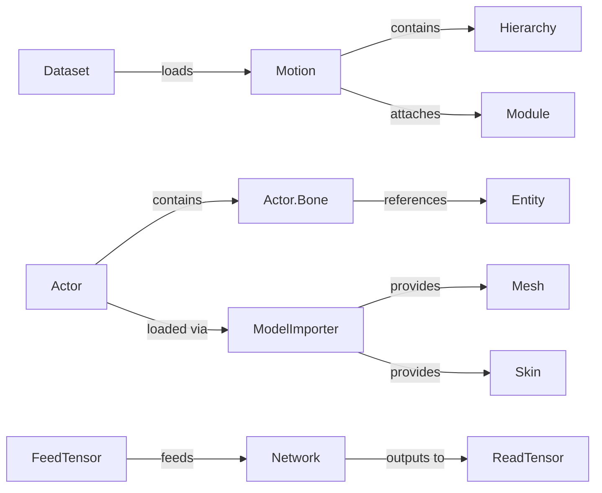

# Data Models

Comprehensive reference for all data model definitions used across AI4AnimationPy.

---

## Motion

**File:** `ai4animation/Animation/Motion.py`

| Field | Type | Description |
|-------|------|-------------|
| `Name` | `str` | Clip name (typically filename) |
| `Hierarchy` | `Hierarchy` | Bone tree structure |
| `Frames` | `ndarray [F, J, 4, 4]` | Per-frame global bone transforms (4×4 homogeneous matrices) |
| `Framerate` | `float` | Frames per second |
| `Modules` | `List[Module]` | Attached analysis modules |
| `Symmetry` | `List[int]` | Left/right mirror index mapping |
| `MirrorAxis` | `Vector3.Axis` | Axis for mirroring (default: ZPositive) |

**Notes:** Frames are 4×4 homogeneous matrices in **global space**. Velocity is computed on-the-fly via finite differences. Serialization uses NPZ format storing positions `[F, J, 3]` and quaternions `[F, J, 4]`.

---

## Hierarchy

**File:** `ai4animation/Animation/Motion.py`

| Field | Type | Description |
|-------|------|-------------|
| `BoneNames` | `List[str]` | Ordered bone names |
| `ParentNames` | `List[str]` | Parent name per bone (`None` for root) |
| `ParentIndices` | `List[int]` | Parent index per bone (`-1` for root) |
| `NameToIndex` | `Dict[str, int]` | Name → index lookup |

---

## Actor.Bone

**File:** `ai4animation/Components/Actor.py`

| Field | Type | Description |
|-------|------|-------------|
| `Actor` | `Actor` | Owning actor component |
| `Index` | `int` | Index into actor's Transforms tensor |
| `Entity` | `Entity` | Corresponding scene entity |
| `Parent` | `Bone` | Parent bone (`None` for root) |
| `Children` | `List[Bone]` | Direct child bones |
| `Successors` | `List[int]` | All descendant bone indices (flattened) |
| `ZeroTransform` | `ndarray [4, 4]` | Rest-pose transform relative to parent |

---

## Mesh

**File:** `ai4animation/Import/ModelImporter.py`

| Field | Type | Description |
|-------|------|-------------|
| `Name` | `str` | Mesh name identifier |
| `Vertices` | `ndarray [V, 3]` | Vertex positions |
| `Normals` | `ndarray [V, 3]` | Vertex normals |
| `Triangles` | `ndarray [T*3]` | Triangle indices (flat) |
| `SkinIndices` | `ndarray [V, K]` | Bone indices per vertex (K influences) |
| `SkinWeights` | `ndarray [V, K]` | Blend weights per vertex |
| `HasSkinning` | `bool` | Whether skinning data is present |

---

## Skin

**File:** `ai4animation/Import/ModelImporter.py`

| Field | Type | Description |
|-------|------|-------------|
| `Inverse_bind_matrices` | `ndarray [J, 4, 4]` | Inverse bind-pose matrices per joint |
| `Joints` | `ndarray [J]` | Joint indices into the node hierarchy |

---

## Dataset

**File:** `ai4animation/Animation/Dataset.py`

| Field | Type | Description |
|-------|------|-------------|
| `Directory` | `str` | Root directory for NPZ files |
| `Modules` | `List[callable]` | Module factory lambdas |
| `Pool` | `List[str]` | All discovered NPZ file paths |
| `Files` | `List[str]` | Filtered file paths (after exclusions) |
| `NameToIndex` | `Dict[str, int]` | Filename → index lookup |

---

## TimeSeries

**File:** `ai4animation/Animation/TimeSeries.py`

| Field | Type | Description |
|-------|------|-------------|
| `Start` | `float` | Window start time (seconds, often negative for past) |
| `End` | `float` | Window end time (seconds, positive for future) |
| `Samples` | `List[Sample]` | Evenly spaced time samples |

**Computed Properties:**

| Property | Type | Description |
|----------|------|-------------|
| `SampleCount` | `int` | Number of samples |
| `Window` | `float` | Total window duration (`End - Start`) |
| `DeltaTime` | `float` | Time between consecutive samples |
| `MaximumFrequency` | `float` | Nyquist frequency (`1 / (2 * DeltaTime)`) |
| `Timestamps` | `ndarray` | Array of all sample timestamps |

---

## FeedTensor

**File:** `ai4animation/AI/FeedTensor.py`

| Field | Type | Description |
|-------|------|-------------|
| `Name` | `str` | Tensor identifier |
| `Shape` | `tuple` | Expected shape |
| `Dims` | `int` | Feature dimension |
| `Pivot` | `int` | Current write position |
| `Data` | `tensor` | Underlying data buffer |

**Usage pattern:** Sequential `Feed()` calls fill the buffer, `GetTensor()` returns the assembled input.

---

## ReadTensor

**File:** `ai4animation/AI/ReadTensor.py`

| Field | Type | Description |
|-------|------|-------------|
| `Name` | `str` | Tensor identifier |
| `Shape` | `tuple` | Expected shape |
| `Dims` | `int` | Feature dimension |
| `Pivot` | `int` | Current read position |
| `Data` | `tensor` | Underlying data buffer |

**Usage pattern:** Sequential `Read(shape)` calls extract structured data from network output.

---

## Relationships

