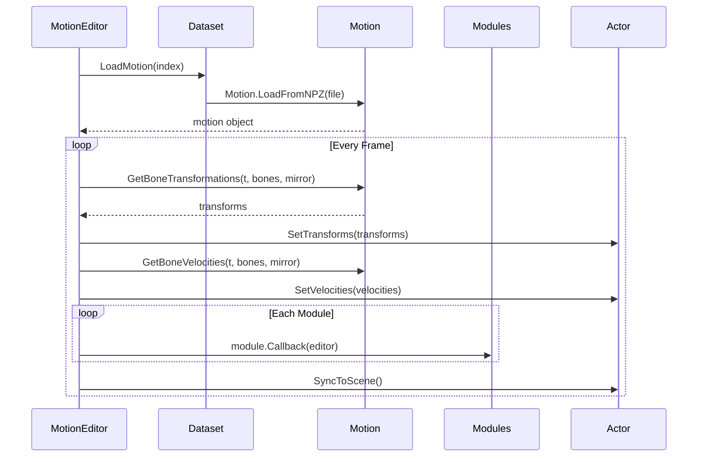

# Motion & Animation Data

Core data containers for animation frames, skeleton hierarchies, motion datasets, and temporal windowing.

---

## Motion

**File:** `ai4animation/Animation/Motion.py`

The `Motion` class stores per-frame bone transforms as `[NumFrames, NumJoints, 4, 4]` tensors. It supports loading from NPZ, GLB, FBX, and BVH formats, mirroring, and module attachment.

### Properties

| Property | Type | Description |
|----------|------|-------------|
| `Name` | `str` | Clip name (typically filename) |
| `Hierarchy` | `Hierarchy` | Bone tree structure |
| `Frames` | `ndarray [F, J, 4, 4]` | Per-frame global bone transforms |
| `Framerate` | `float` | Frames per second |
| `Modules` | `List[Module]` | Attached analysis modules |
| `Symmetry` | `List[int]` | Left/right mirror indices |
| `MirrorAxis` | `Vector3.Axis` | Axis for mirroring (default: ZPositive) |

### Key Methods

| Method | Description |
|--------|-------------|
| `GetBoneTransformations(timestamps, bone_names, mirrored)` | Core sampling method; handles mirroring and corrections |
| `GetBonePositions(timestamps, bone_names, mirrored)` | Convenience wrapper for positions only |
| `GetBoneRotations(timestamps, bone_names, mirrored)` | Convenience wrapper for rotations only |
| `GetBoneVelocities(timestamps, bone_names, mirrored)` | Velocity via finite differences |
| `AddModule(module)` | Attaches an animation analysis module |
| `SaveToNPZ(path)` | Serializes to compressed NPZ |

### Loaders (Class Methods)

| Method | Description |
|--------|-------------|
| `LoadFromNPZ(path)` | Load from compressed NPZ file |
| `LoadFromGLB(path)` | Load from GLB (glTF Binary) |
| `LoadFromFBX(path)` | Load from FBX (Autodesk) |
| `LoadFromBVH(path)` | Load from BVH (Motion Capture) |

### NPZ Format

The internal NPZ format stores:

| Key | Shape | Description |
|-----|-------|-------------|
| `positions` | `[F, J, 3]` | World positions per frame |
| `quaternions` | `[F, J, 4]` | Rotations as `[x, y, z, w]` quaternions |
| `bone_names` | `[J]` | Ordered bone name strings |
| `parent_names` | `[J]` | Parent name per bone (`None` for root) |
| `framerate` | scalar | Frames per second |

### Playback Flow



---

## Hierarchy

**File:** `ai4animation/Animation/Motion.py`

The `Hierarchy` class stores the bone tree structure for a skeleton.

### Properties

| Property | Type | Description |
|----------|------|-------------|
| `BoneNames` | `List[str]` | Ordered bone names |
| `ParentNames` | `List[str]` | Parent name per bone (`None` for root) |
| `ParentIndices` | `List[int]` | Parent index per bone (`-1` for root) |
| `NameToIndex` | `Dict[str, int]` | Name → index lookup |

---

## Dataset

**File:** `ai4animation/Animation/Dataset.py`

The `Dataset` class discovers and loads NPZ motion files from a directory, with support for filtering and module attachment.

### Properties

| Property | Type | Description |
|----------|------|-------------|
| `Directory` | `str` | Root directory for NPZ files |
| `Modules` | `List[callable]` | Module factory lambdas |
| `Pool` | `List[str]` | All discovered NPZ paths |
| `Files` | `List[str]` | Filtered file paths |
| `NameToIndex` | `Dict[str, int]` | Filename → index |

### Usage

```python
from ai4animation import Dataset, RootModule, ContactModule

dataset = Dataset(
    "path/to/motions",
    [
        lambda x: RootModule(x, hip, l_hip, r_hip, l_shoulder, r_shoulder),
        lambda x: ContactModule(x, [(ankle, 0.1, 0.25)]),
    ],
)

motion = dataset.LoadMotion(0)
```

---

## TimeSeries

**File:** `ai4animation/Animation/TimeSeries.py`

The `TimeSeries` class provides a temporal windowing abstraction for evenly-spaced time samples.

### Properties

| Property | Type | Description |
|----------|------|-------------|
| `Start` | `float` | Window start (seconds, often negative) |
| `End` | `float` | Window end (seconds) |
| `Samples` | `List[Sample]` | Evenly spaced samples |
| `SampleCount` | `int` | Number of samples |
| `Window` | `float` | Total window duration |
| `DeltaTime` | `float` | Time between samples |
| `MaximumFrequency` | `float` | Nyquist frequency |
| `Timestamps` | `ndarray` | Array of sample timestamps |
