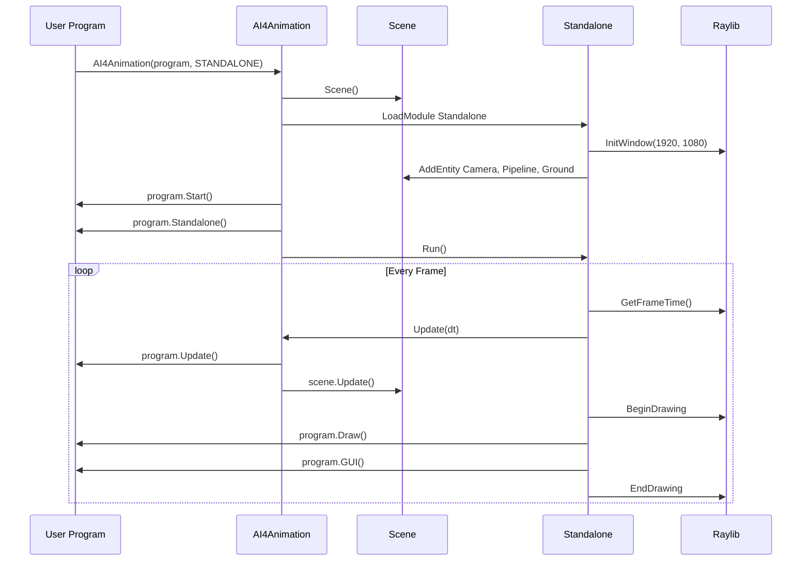

# Lifecycle & Update Loop

AI4AnimationPy follows a game-engine-style lifecycle with distinct phases for initialization, updating, rendering, and GUI. Understanding this lifecycle is essential for writing correct programs.

---

## Engine Bootstrap



---

## Lifecycle Phases

### 1. Initialization

When `AI4Animation(program, mode)` is called:

1. A `Scene` is created
2. If `mode == STANDALONE`, the Standalone renderer is loaded (Raylib window, camera, render pipeline)
3. `program.Start()` is called — set up entities, components, and data here
4. `program.Standalone()` is called (standalone mode only) — configure GUI, camera targets

### 2. Update Phase

Called every frame before rendering:

```
AI4Animation.__UPDATE__()
├── program.Update()      # Your game logic
└── scene.Update()        # Iterates all entities
    └── entity.Update()   # For each entity
        └── component.Update()  # For each attached component
```

**Order:** Your program's `Update()` runs first, then the scene updates all entities and their components.

### 3. Draw Phase

Called every frame inside the render pass (standalone only):

```
AI4Animation.__DRAW__()
├── program.Draw()        # Your rendering code
└── scene.Draw()          # Iterates all entities
    └── entity.Draw()     # For each entity
        └── component.Draw()  # For each attached component
```

Use `Draw()` to render debug visualizations, shapes, lines, etc. via `AI4Animation.Draw`.

### 4. GUI Phase

Called every frame after rendering (standalone only):

```
AI4Animation.__GUI__()
├── program.GUI()         # Your UI overlays
└── scene.GUI()           # Iterates all entities
    └── entity.GUI()      # For each entity
        └── component.GUI()  # For each attached component
```

Use `GUI()` for immediate-mode UI elements like sliders, buttons, text overlays.

---

## Frame Timing

The `Time` module provides frame timing globals:

| Property | Type | Description |
|----------|------|-------------|
| `Time.DeltaTime` | `float` | Seconds elapsed since last frame |
| `Time.TotalTime` | `float` | Total seconds since engine start |
| `Time.Timescale` | `float` | Time multiplier (default: 1.0) |

```python
from ai4animation import Time

def Update(self):
    speed = 2.0
    distance = speed * Time.DeltaTime  # Frame-rate independent movement
    angle = 120 * Time.TotalTime       # Continuous rotation
```

!!! note
    `DeltaTime` is pre-multiplied by `Timescale`. Set `Time.Timescale = 0.5` to run at half speed.

---

## Mode-Specific Behavior

| Lifecycle Method | Standalone | Headless | Manual |
|-----------------|-----------|----------|--------|
| `Start()` | ✅ Once | ✅ Once | ✅ Once |
| `Standalone()` | ✅ Once | ❌ | ❌ |
| `Update()` | ✅ Every frame | ✅ Every iteration | ✅ Per `Update()` call |
| `Draw()` | ✅ Every frame | ❌ | ❌ |
| `GUI()` | ✅ Every frame | ❌ | ❌ |

---

## Program Template

Every program follows this pattern:

```python
from ai4animation import AI4Animation


class Program:
    def Start(self):
        # Called once at initialization
        # Create entities, load models, set up data
        pass

    def Standalone(self):
        # Called once after Start (standalone only)
        # Configure camera, create GUI elements
        pass

    def Update(self):
        # Called every frame
        # Game logic, animation, input handling
        pass

    def Draw(self):
        # Called every frame (standalone only, inside render pass)
        # Debug visualization, shape drawing
        pass

    def GUI(self):
        # Called every frame (standalone only, after render)
        # UI overlays, handles, text
        pass


if __name__ == "__main__":
    AI4Animation(Program(), mode=AI4Animation.Mode.STANDALONE)
```

---

## Standalone Renderer Details

When running in standalone mode, the engine creates:

- A **Raylib window** (1920×1080)
- A **Camera** with 4 modes: Free, Fixed, Third-person, Orbit
- A **RenderPipeline** with deferred shading, shadow mapping, SSAO, bloom, FXAA
- A **Ground** plane entity

The render loop sequence per frame:

1. `GetFrameTime()` → compute delta time
2. `Update()` → game logic + scene update
3. `BeginDrawing()` → start render pass
4. `Draw()` → custom rendering
5. `GUI()` → UI overlays
6. `EndDrawing()` → present frame
