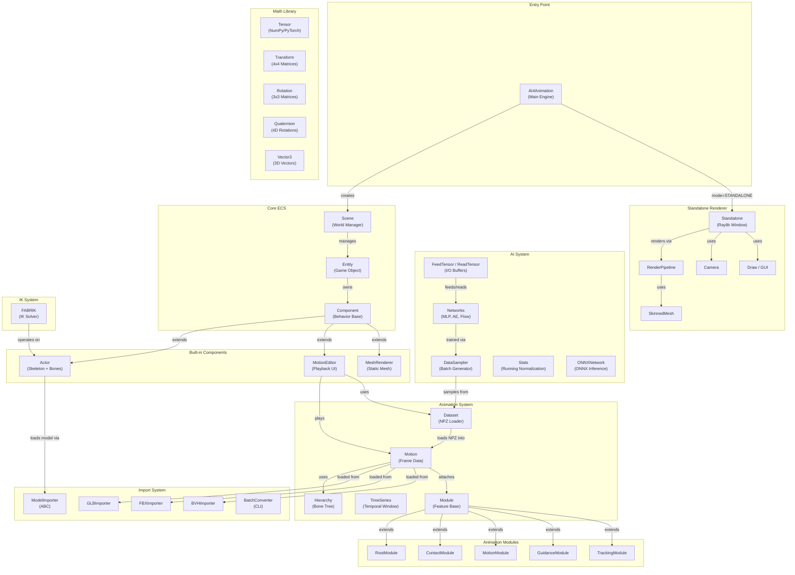

# Architecture Overview

AI4AnimationPy follows a modular, layered architecture. The engine manages a scene of entities with attached components, driven by a game-engine-style update loop.

---

## System Architecture



---

## Component Summary

| Component | Description |
|-----------|-------------|
| **AI4Animation** | Main engine class. Creates the Scene, optionally loads Standalone renderer, manages the update loop. |
| **Scene** | Manages all entities, their transforms (as a contiguous tensor), and scales. Drives per-entity `Update`/`Draw`/`GUI`. |
| **Entity** | A node in the scene graph with position/rotation/scale, parent-child hierarchy, and attached components. |
| **Component** | Abstract base class for behaviors attached to entities. Provides lifecycle hooks: `Start`, `Update`, `Draw`, `GUI`. |
| **Actor** | A skeletal character with `Bone` sub-objects, loaded from GLB/FBX models. Manages transforms, velocities, bone lengths. |
| **Motion** | Stores per-frame bone transforms `[NumFrames, NumJoints, 4, 4]` with serialization to/from NPZ, GLB, FBX, BVH. |
| **Module** | Base class for animation analysis modules (root trajectory, contacts, etc.) attached to a `Motion`. |
| **Tensor** | Dual-backend math layer wrapping NumPy and PyTorch with a unified API (default: NumPy). |
| **DataSampler** | Multi-threaded batch generator for training. Loads motions from a `Dataset` and yields batches. |
| **Standalone** | Raylib-based windowed renderer with deferred rendering pipeline, camera, GUI, and skinned mesh support. |
| **FABRIK** | Forward And Backward Reaching Inverse Kinematics solver operating on `Actor.Bone` chains. |

---

## System Layers

The architecture is organized into distinct layers:

1. **Engine Layer** — `AI4Animation` bootstraps the system and manages the main loop
2. **ECS Layer** — `Scene` → `Entity` → `Component` hierarchy for object management
3. **Animation Layer** — `Motion`, `Dataset`, `Module`, `TimeSeries` for motion data processing
4. **Math Layer** — `Tensor`, `Transform`, `Rotation`, `Quaternion`, `Vector3` for vectorized operations
5. **AI Layer** — Neural network layers, training utilities (`DataSampler`, `FeedTensor`), and inference (`ONNXNetwork`)
6. **Import Layer** — File format parsers (`GLB`, `FBX`, `BVH`) with a common `ModelImporter` interface
7. **Rendering Layer** — Optional Raylib-based windowed renderer with deferred pipeline
8. **IK Layer** — FABRIK inverse kinematics solver

---

## Directory Structure

```
ai4animation/
├── AI4Animation.py          # Engine entry point
├── Scene.py                 # World manager
├── Entity.py                # Scene graph node
├── Time.py                  # Frame timing
├── Utility.py               # Helper functions
├── AssetManager.py          # Asset path resolution
├── Profiler.py              # Performance profiling
├── Components/
│   ├── Component.py         # Base component class
│   ├── Actor.py             # Skeletal character
│   ├── MotionEditor.py      # Motion playback UI
│   └── MeshRenderer.py      # Static mesh renderer
├── Animation/
│   ├── Motion.py            # Frame data + Hierarchy
│   ├── Dataset.py           # NPZ file loader
│   ├── TimeSeries.py        # Temporal window
│   ├── Module.py            # Feature module base
│   ├── RootModule.py        # Root trajectory
│   ├── ContactModule.py     # Foot contacts
│   ├── MotionModule.py      # Full-body trajectory
│   ├── GuidanceModule.py    # Pose guidance
│   └── TrackingModule.py    # 3-point tracking
├── Math/
│   ├── Tensor.py            # Dual-backend arrays
│   ├── Transform.py         # 4×4 matrices
│   ├── Rotation.py          # 3×3 matrices
│   ├── Quaternion.py        # Quaternion operations
│   └── Vector3.py           # 3D vector operations
├── AI/
│   ├── Modules.py           # NN layers
│   ├── DataSampler.py       # Batch generator
│   ├── FeedTensor.py        # Input buffer
│   ├── ReadTensor.py        # Output buffer
│   ├── Stats.py             # Running normalization
│   ├── ONNXNetwork.py       # ONNX inference
│   └── Networks/            # Architecture implementations
├── Import/
│   ├── ModelImporter.py     # Abstract base
│   ├── GLBImporter.py       # GLB parser
│   ├── FBXImporter.py       # FBX parser
│   ├── BVHImporter.py       # BVH parser
│   └── BatchConverter.py    # CLI converter
├── IK/
│   └── FABRIK.py            # IK solver
└── Standalone/
    ├── Standalone.py        # Raylib window
    ├── RenderPipeline.py    # Deferred pipeline
    ├── Camera.py            # 4-mode camera
    ├── Draw.py              # Drawing utilities
    ├── GUI.py               # Immediate-mode GUI
    └── SkinnedMesh.py       # GPU skinning
```

---

## Utility & Support Modules

| Module | Purpose |
|--------|---------|
| `Utility.py` | `LoadModule`, `SetSeed`, `SaveONNX`, `SymmetryIndices` |
| `AssetManager.py` | Asset file path resolution |
| `Time.py` | `TotalTime`, `DeltaTime`, `Timescale` globals |
| `Profiler.py` | `cProfile`-based profiler with periodic stats |
