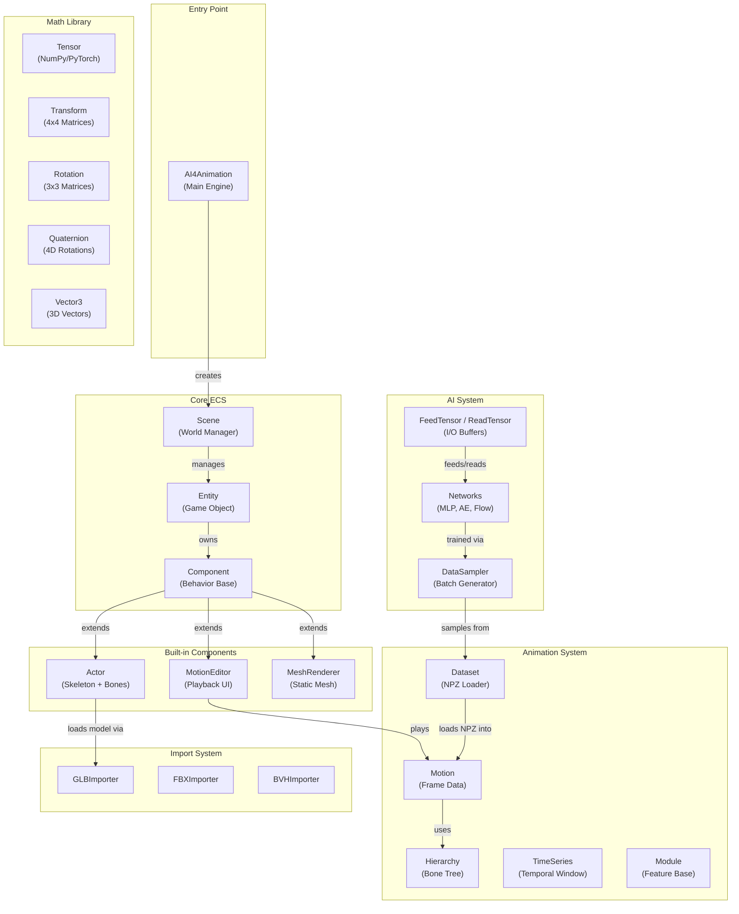

# AI4AnimationPy

**AI4AnimationPy** is a Python framework for AI-driven character animation using neural networks, developed by [Paul Starke](https://github.com/paulstarke) and [Sebastian Starke](https://github.com/sebastianstarke).

It provides motion capture processing, training & inference, animation engineering, and optional real-time rendering — all in Python via NumPy/PyTorch. It replaces the Unity dependency of [AI4Animation](https://github.com/sebastianstarke/AI4Animation) by unifying data processing, feature extraction, neural network training/inference, and visualization into a single Python framework.

---

## Key Features

- :material-cube-outline: **Entity-Component-System (ECS)** architecture with game-engine-style lifecycle (`Update` / `Draw` / `GUI`)
- :material-math-compass: **Vectorized math library** — quaternions, axis-angle, matrices, Euler, mirroring
- :material-brain: **Neural network architectures** — MLP, Autoencoder, Flow Matching, Codebook Matching
- :material-monitor: **Optional real-time rendering** via Raylib (deferred pipeline, shadow mapping, SSAO, bloom, FXAA)
- :material-bone: **GPU-accelerated skinned mesh rendering**
- :material-target: **FABRIK inverse kinematics** solver
- :material-chart-timeline: **Motion feature modules** — root trajectory, joint contacts, tracking, guidance
- :material-camera: **4-mode camera system** — Free, Fixed, Third-person, Orbit
- :material-file-import: **GLB, FBX, BVH import pipeline** with NPZ serialization
- :material-cog: **Three execution modes** — Standalone, Headless, Manual

---

## Technology Stack

| Layer | Technology |
|-------|-----------|
| Language | Python 3.12+ |
| Math Backend | NumPy (default), PyTorch (switchable) |
| Neural Networks | PyTorch, ONNX Runtime |
| Rendering | Raylib (optional) |
| Motion Formats | GLB, FBX, BVH, NPZ |
| 3D Model Parsing | pygltflib, custom FBX parser |
| Packaging | setuptools, pip |

---

## Architecture Overview

---

## Quick Links

- :material-download: **[Installation](getting-started/installation.md)** — Set up your environment
- :material-rocket-launch: **[Quick Start](getting-started/quickstart.md)** — Run your first program
- :material-sitemap: **[Architecture](architecture/overview.md)** — Understand the system design
- :material-api: **[API Reference](api/actor.md)** — Explore the full API
- :material-school: **[Tutorials](tutorials/custom-component.md)** — Step-by-step guides
- :material-format-list-bulleted: **[Demos](demos.md)** — Browse example programs

