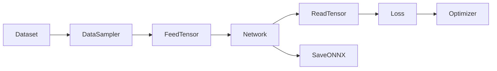

# Tutorial: Training a Network

This tutorial walks through the end-to-end training pipeline, from loading motion data to training a neural network and exporting it for inference.

---

## Pipeline Overview



1. **Dataset** discovers and loads NPZ motion files
2. **DataSampler** generates batches of (motion, timestamps) pairs
3. **FeedTensor** assembles input feature vectors
4. **Network** processes the input
5. **ReadTensor** reads structured output
6. **Loss** computes training loss
7. **SaveONNX** exports for deployment

---

## Step 1: Define the Network

```python
import torch
from ai4animation import MLP, Tensor

network = Tensor.ToDevice(
    MLP.Model(input_dim=256, output_dim=128, hidden_dim=512, dropout=0.1)
)
```

Available architectures in `ai4animation/AI/Networks/`:

- `MLP` — Multi-layer perceptron
- `Autoencoder` — Variational autoencoder
- `Flow` — Flow matching
- `ConditionalFlow` — Conditional flow matching
- `CodebookMatching` — Codebook-based matching
- `PAE` — Periodic Autoencoder

---

## Step 2: Set Up Training

```python
from ai4animation import AdamW, CyclicScheduler

optimizer = AdamW(network.parameters(), lr=1e-4, weight_decay=1e-4)
scheduler = CyclicScheduler(
    optimizer=optimizer,
    batch_size=32,
    epoch_size=320,
    restart_period=10,
    t_mult=2,
    policy="cosine",
    verbose=True,
)
```

---

## Step 3: Training Loop

A minimal training example (derived from `Demos/AI/ToyExample/Program.py`):

<video controls autoplay loop muted width="100%">
  <source src="../../assets/videos/TrainingToyExample.mp4" type="video/mp4">
</video>

```python
import numpy as np
import torch
from ai4animation import AdamW, AI4Animation, CyclicScheduler, MLP, Plotting, Tensor


class Program:
    def Start(self):
        self.EpochCount = 150
        self.BatchSize = 32
        self.BatchCount = 10
        self.SampleCount = self.BatchSize * self.BatchCount

        self.Network = Tensor.ToDevice(
            MLP.Model(input_dim=1, output_dim=100, hidden_dim=128, dropout=0.1)
        )
        self.Optimizer = AdamW(
            self.Network.parameters(), lr=1e-4, weight_decay=1e-4
        )
        self.Scheduler = CyclicScheduler(
            optimizer=self.Optimizer,
            batch_size=self.BatchSize,
            epoch_size=self.SampleCount,
            restart_period=10,
            t_mult=2,
            policy="cosine",
            verbose=True,
        )
        self.LossHistory = Plotting.LossHistory(
            "Loss History", drawInterval=500, yScale="log"
        )
        self.Trainer = self.Training()

    def Update(self):
        try:
            next(self.Trainer)
        except StopIteration:
            pass

    def Training(self):
        for e in range(1, self.EpochCount + 1):
            print("Epoch", e)
            for _ in range(self.BatchCount):
                x = self.GetInput()
                y = self.GetOutput(x)
                xBatch = Tensor.ToDevice(torch.tensor(x, dtype=torch.float32))
                yBatch = Tensor.ToDevice(torch.tensor(y, dtype=torch.float32))

                _, losses = self.Network.learn(xBatch, yBatch, e == 1)
                self.Optimizer.zero_grad()
                sum(losses.values()).backward()
                self.Optimizer.step()
                self.Scheduler.batch_step()

                for k, v in losses.items():
                    self.LossHistory.Add((Plotting.ToNumpy(v), k))

                yield

            self.Scheduler.step()
            self.LossHistory.Print()

    def GetInput(self):
        x = np.random.uniform(0, 1, self.BatchSize)
        return x.reshape(self.BatchSize, 1)

    def GetOutput(self, x):
        y = np.linspace(-1, 1, 100)
        y = np.power(y, 2)
        y = y.reshape(1, -1).repeat(self.BatchSize, axis=0)
        return y * x


if __name__ == "__main__":
    AI4Animation(Program(), mode=AI4Animation.Mode.STANDALONE)
```

!!! note
    The `Training()` method is a **generator** — it `yield`s after each batch so the engine can update the display. This enables live visualization of training progress in standalone mode.

---

## Step 4: Input/Output Normalization

Use `RunningStats` for online normalization:

```python
from ai4animation.AI.Stats import RunningStats

input_stats = RunningStats(dim=input_dim)
output_stats = RunningStats(dim=output_dim)

# During training:
input_stats.Update(x_batch)
x_normalized = input_stats.Normalize(x_batch)

y_pred_normalized = network(x_normalized)
y_pred = output_stats.Denormalize(y_pred_normalized)
```

---

## Step 5: Export to ONNX

After training, export the model for fast inference:

```python
from ai4animation import Utility

Utility.SaveONNX(network, input_dim, "model.onnx")
```

Load for inference:

```python
from ai4animation import ONNXNetwork

model = ONNXNetwork("model.onnx")
output = model.Run(input_tensor)
```
